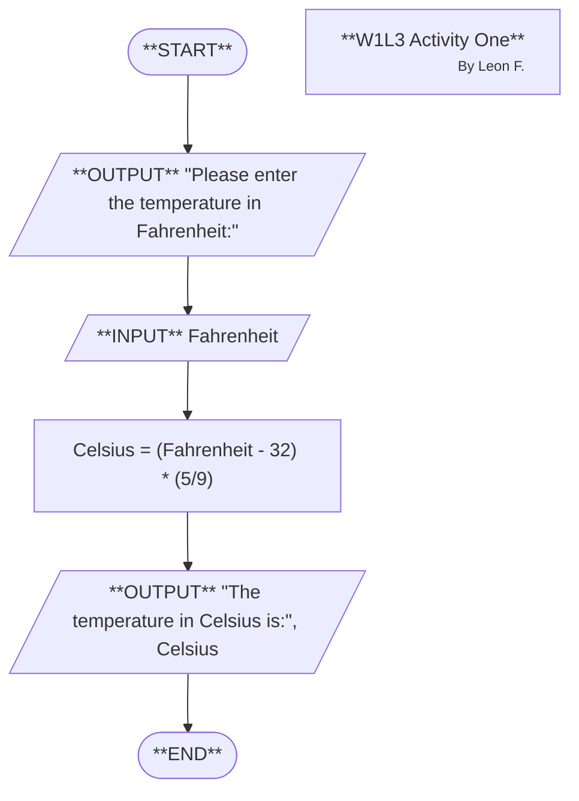

```mermaid
graph TD

A([**START**])
B[/**OUTPUT** "Please enter the temperature in Fahrenheit:"/]
C[/**INPUT** Fahrenheit/]
D[" Celsius = (Fahrenheit - 32) * (5/9)"]
E[/**OUTPUT** "The temperature in Celsius is:", Celsius/]
F([**END**])

Z[**W1L3 Activity One**<br><p style="font-size:9pt;text-align:right">By Leon F. </p>]

A --> B --> C --> D --> E --> F


```

