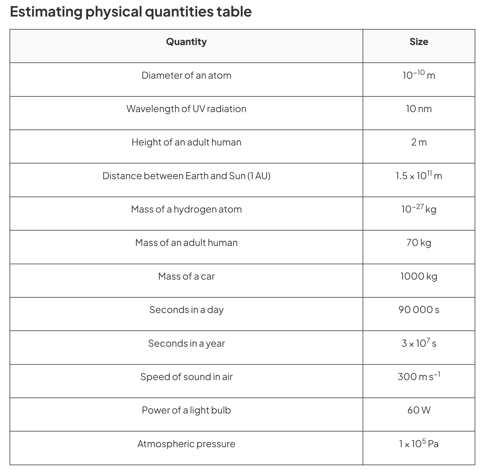

# 1 Physical quantities and units

## 1.1 Physical quantities

**Physical quantity** := a quantity that can be measured and *consists of a numerical magnitude and unit*. 

| Quantity                              | Size                       |
| :------------------------------------ | :------------------------- |
| Diameter of an atom                   | $10^{−10} \mathrm{m}$      |
| Wavelength of UV radiation            | $10 \mathrm{nm}$           |
| Height of an adult human              | $2 \mathrm{m}$             |
| Distance between Earth and Sun (1 AU) | $1.5 × 10^{11} \mathrm{m}$ |
| Mass of a hydrogen atom               | $10^{−27} \mathrm{kg}$     |
| Mass of an adult human                | $70 \mathrm{kg}$           |
| Mass of a car                         | $1000 \mathrm{kg}$         |
| Seconds in a day                      | $90 000 \mathrm{s}$        |
| Seconds in a year                     | $3 × 10^7 \mathrm{s}$      |
| Speed of sound in air                 | $300 \mathrm{ms^{−1}}$     |
| Power of a light bulb                 | $60 \mathrm{W}$            |
| Atmospheric pressure                  | $1 × 10^5 \mathrm{Pa}$     |

> From Save My Exams

## 1.2 SI units
**Base quantities** are the quantities on the basis of which other quantities are expressed. 

**Derived quantities** are the quantities that are expressed in terms of base quantities. 

A derived quantity has an equation which links to other quantities (e.g. $F=ma$). 

length, mass, time, current, temperature, amount of substance and luminous intensity

SI units: s,m,kg,A,K,mol,cd

T G M k m 
tera giga mega kilo
milli micro nano pico

# Homogeneity of an equation

An equation is **homogeneous** if quantities on BOTH sides of the equation has the same unit. 

A homogeneous equation may not be physically correct, but a physically correct equation will always be homogeneous.

The speed $v$ of a liquid leaving a tube depends on the change in pressure $\Delta P$ and the density $\rho$ of the liquid. The speed is given by the equation

$$
v = k(\frac{\Delta P}{\rho})^n
$$

Where k is a constant that has no units

What is the value of n?

For AS: $g = 9.81ms^{-2}$

# Significant figures

digits considered significant: non-zero digits, zeros who:

appearing anywhere between two non-zero digits

trailing zeros in a number containing a decimal point

digits considered not significant: leading zeros, trailing zeros in a number without a decimal point

# Estimations

atmospheric pressure 1e5

light takes 5e2 s to reach us from the Sun

frequency of uv light: 7.5e14 to 3e16 Hz

life-span of a man: 2e9 s

看savemyexams

# Measurements

## Length

measuring tape(long), metre rule(short)

cm, cm, mm

Meter rule: 0, 100, 1

**vernier caliper**(游标卡尺): 0,15,0.02

main scale + vernier scale

**micrometer screw gauge**: 0, 2.5, 0.01

main scale(0.5) + fractional scale(0.01)

Check zero

Repeat & Average

Avoid parallax error

## Mass

balance

# Error

Random errors:

- occur in all measurements

- unpredictable

- can be reduced by average

Systematic errors:

- not random but constant

- consistently underestimate or overestimate a reading

- can be eliminated

Zero Error

Parallax Error

**

**Precision** is the degree of exactness to which a measurement can be reproduced. 

- affected by random error

- improve: repeat and average

**Accuracy** describes how well the result agrees with an accepted value. 

- affected by systematic error

- improve: technique, accurate instrument

# Uncertainty

Three main types of uncertainty:

- Random Uncertainties

- Systematic Errors

- Reading Uncertainties

**The Limit of Reading** of a measurement is equal to the smallest graduation of the scale of an instrument. 

**The Degree of Uncertainty** of a reading (end reading) is equal to half the smallest graduation of the scale of an instrument. 

Absolute / fractional errors and percentage errors

1 mm - 1/208 - 0.48%

random uncertainties = max-min/num :: always 1 s.f.

percentage uncertainty :: 1 / 2 s.f.

## Calculation

Absolute Uncertainty

$y = b \pm c \Rightarrow \Delta y = \Delta b + \Delta c$

Percentage Uncertainty

$
\left. 
\begin{aligned}
&y=b\cdot c \\
&y = \frac{b}{c}
\end{aligned}
\right\}
\Rightarrow
\frac{\Delta y}{y} = \frac{\Delta b}{b} + \frac{\Delta c}{c}
$

$y = a^n \Rightarrow \frac{\Delta y}{y} = n \cdot \frac{\Delta a}{a}$

When the value times a constant, the absolute uncertainty changes but the percentage uncertainty doesn't. 

As the s.f. of the absolute uncertainty is always one, the s.f. of the value can therefore be determined. 

# 1.4 Scalars and Vectors*

Scalar: magnitude

Vector: magnitude + direction

Vector addition

Direction N of E : 0~45
